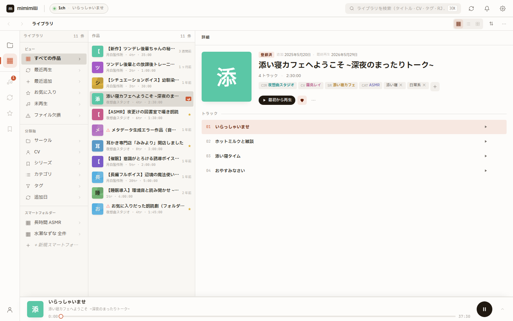
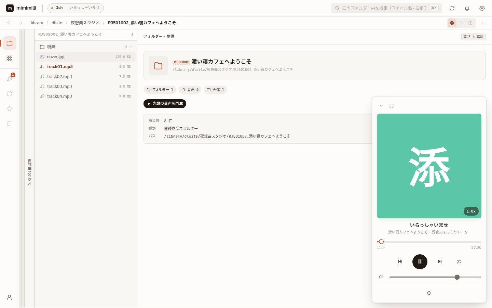

# mimimilli

ローカル音声作品を管理して再生する Web アプリ。
DLsite や FANZA からダウンロードした音声作品を、手元の環境で快適に扱うためのツールです。

## 特徴

- **Library モード**：軸レール（サークル、CV、タグ別ピボット）、コンテンツ列、プレビューの 3 ペインで登録済み作品をブラウズ
- **Files モード**：ルートフォルダー以下の物理ファイルシステムをそのまま巡回し、未登録フォルダーも表示
- **タグ AND/OR 絞り込み**：複数タグを組み合わせ、ヒット件数をリアルタイム更新
- **スマートフォルダー**：WHERE/AND/AND NOT の保存クエリで作品を動的に抽出
- **タグベースの管理**：フラットタグと Annotated タグ（`cv/名前`、`サークル/名前`）で作品を整理
- **メタファイル駆動**：`.meta.json` を正本とし、SQLite は検索と一覧表示のキャッシュとして再構築可能
- **自動スキャン**：音声ファイルを含むフォルダーからメタファイルを自動生成
- **常駐プレイヤー**：作品を眺めながら再生を継続し、必要に応じて全画面プレイヤーへ展開

## スクリーンショット


Library モード（軸レール・作品一覧・詳細プレビューの3ペインと再生バー）


Files モード（物理フォルダーの巡回とポップアッププレイヤー）

## 技術スタック

| レイヤー             | 技術                                                          |
| -------------------- | ------------------------------------------------------------- |
| バックエンド         | Hono + Node.js（TypeScript、`node --watch` でネイティブ実行） |
| フロントエンド       | React 19 + TypeScript                                         |
| ビルド               | Vite 7                                                        |
| 状態管理             | TanStack Query + Jotai                                        |
| スタイリング         | Tailwind CSS 4                                                |
| データベース         | SQLite（Drizzle ORM / better-sqlite3）                        |
| API 契約             | Zod スキーマ（`shared/` で client と server が共有）          |
| 開発プロキシ         | portless                                                      |
| パッケージマネージャ | pnpm（ワークスペース：client / server / shared）              |

## セットアップ

### 前提条件

- **Node.js** 24+
- **pnpm**（開発は v11 系で確認）

### インストールと起動

```bash
# リポジトリのクローン
git clone <repository-url> mimimilli
cd mimimilli

# 依存関係（ルートのワークスペースで一括）
pnpm install

# 開発サーバー起動（fixture アダプタの API も同じプロセスで動く）
pnpm dev
# => http://mimi.localhost:1355
```

`pnpm dev` は `pnpm dev:fixture` のエイリアスとして、ルートから client を起動する。
`vite.config.ts` は server の Hono アプリ（fixture アダプタ注入）を dev middleware として `/api/*` にマウントするため、UI とモック API が同一プロセスで動く。
代表的な fixture シナリオは、次のコマンドで切り替える。

```bash
pnpm dev:fixture:new-work
pnpm dev:fixture:empty
pnpm dev:fixture:errors
```

実 SQLite と実ファイルシステムの real アダプタへ接続する場合は、サーバーとフロントを一括起動できる。

```bash
# API サーバー（real アダプタ）とフロントを起動
pnpm dev:real
# => http://localhost:8080
# => http://mimi.localhost:1355
# SQLite パスは MIMIMILLI_DB で変更可（デフォルト ./data/mimimilli.db）
```

サーバーとフロントを別々に起動する場合は、次のコマンドを使う。

```bash
# ターミナル 1: API サーバーを起動（real アダプタ）
pnpm dev:real:server
# => http://localhost:8080

# ターミナル 2: フロントを API サーバーへ向けて起動
pnpm dev:real:client
# => http://mimi.localhost:1355（BACKEND_URL=http://localhost:8080 を内包）
```

`pnpm dev:real` はサーバーと client を並行起動するため、サーバーの起動完了前に client が一時的に API 接続に失敗することがある。
その場合はブラウザをリロードすればよい。
`dev:real:client` の接続先はサーバーのデフォルトポート `8080` を前提にしている。
`PORT` を変える場合は client 側の `BACKEND_URL` も合わせる。

real アダプタを使う場合、初回起動後に UI からルートフォルダーを設定する。
`better-sqlite3` などのネイティブモジュールは WSL と Windows で同じ `node_modules` を共有できないため、両方の環境で扱うなら環境ごとに別クローンを使うか `pnpm install` をやり直す。

### 検証

```bash
pnpm check          # shared + server + client の型チェック
pnpm test           # server + client のユニットテスト
pnpm smoke:real     # 固定のサンプル音声で real 経路を手動スモーク
pnpm test:server    # server のみ（node --test）
pnpm test:client    # client のみ（vitest）
pnpm test:visual    # Playwright ビジュアルリグレッション
pnpm test:visual:update  # ビジュアルスナップショット再生成
```

## 使い方

1. 初回起動時にルートフォルダー（音声作品を保存しているフォルダー）を選択
2. 自動スキャンが実行され、作品が検出される
3. Library モードで軸ピボットを表示し、Files モードで物理フォルダーを巡回
4. タグの追加や削除で作品を整理

### メタファイルについて

各作品フォルダー内に `.meta.json` を配置すると、mimimilli はそのフォルダーを作品として認識します。
スキャン時にメタファイルがないフォルダーでは、`.meta.json` が自動生成されます。

```jsonc
{
  "id": "uuid-xxxx-xxxx",
  "title": "作品タイトル",
  "urls": [{ "label": "DLsite", "url": "https://..." }],
  "tags": ["バイノーラル", "cv/名前", "サークル/名前"],
  "coverImage": "cover.jpg",
  "playlists": [
    {
      "name": "default",
      "tracks": [
        { "title": "導入", "file": "01_導入.mp3" },
        { "title": "本編", "file": "02_本編.mp3" },
      ],
    },
  ],
  "defaultPlaylist": "default",
  "createdAt": "2026-01-01T00:00:00.000Z",
}
```

### キーボードショートカット

| キー      | 機能                     |
| --------- | ------------------------ |
| `Space`   | 再生/一時停止            |
| `←` / `→` | 10秒戻す / 10秒送る      |
| `Escape`  | パネルやモーダルを閉じる |

`Space` と `←` / `→` は、入力欄にフォーカスがある間は無効。

## プロジェクト構造

```
mimimilli/
├── client/                  # フロントエンド (React 19 + TypeScript + Vite)
│   ├── src/
│   │   ├── app/             # アプリルート、プロバイダー、グローバルショートカット
│   │   ├── features/        # 機能単位モジュール (library/files/player/scan/settings/setup/navigation)
│   │   ├── entities/        # ドメインエンティティ (work/)
│   │   └── shared/          # 共通ユーティリティ、UI、API クライアント
│   ├── tests/
│   │   ├── unit/            # vitest 単体テスト
│   │   └── visual/          # Playwright ビジュアルリグレッションテスト
│   ├── vite.config.ts
│   └── package.json
├── server/                  # HTTP API サーバー (Hono + Node.js / TypeScript)
│   └── src/
│       ├── index.ts         # エントリポイント (env: PORT/MIMIMILLI_ADAPTER/MIMIMILLI_DB/MIMIMILLI_MOCK_SCENARIO)
│       ├── app.ts           # createApp（アダプタ注入）
│       ├── adapter.ts       # DataAdapter インターフェース
│       ├── adapters/
│       │   ├── fixture/     # インメモリ開発データ（旧 client/mocks を統合）
│       │   └── real/        # SQLite(Drizzle) + 実FS: scanner / dlsite / meta / workRepo ほか
│       ├── core/            # ドメインロジック (worksQuery / axisFacets / smartFolder)
│       └── routes/          # HTTP ルート定義
├── shared/                  # Zod スキーマ正典（API 契約 v2、client/server 共有）
├── backlog/                 # タスク管理（Backlog.md CLI。`pnpm backlog` で操作、直接編集禁止）
└── docs/                    # 設計ドキュメント（地図は docs/README.md）
    ├── HANDOFF.md           # 開発の現状・引き継ぎ
    ├── adr/                 # アーキテクチャ決定記録
    ├── issues/              # 過去の作業記録アーカイブ（凍結）
    └── design-system.md      # デザインシステム規約（カラートークン等）
```

## 開発ドキュメント

開発に参加する場合は、次の順に読むと現状を把握できます。

- [docs/README.md](docs/README.md) — ドキュメント全体の地図（どれが現行の正か）
- [docs/HANDOFF.md](docs/HANDOFF.md) — アーキテクチャ・開発コマンド・ハマりどころの引き継ぎ
- 未完了タスク — `pnpm backlog task list --plain`（[Backlog.md CLI](https://github.com/MrLesk/Backlog.md) で管理）
- [AGENTS.md](AGENTS.md) — コミット規約・実装方針などの開発ルール

## ライセンス

Private
