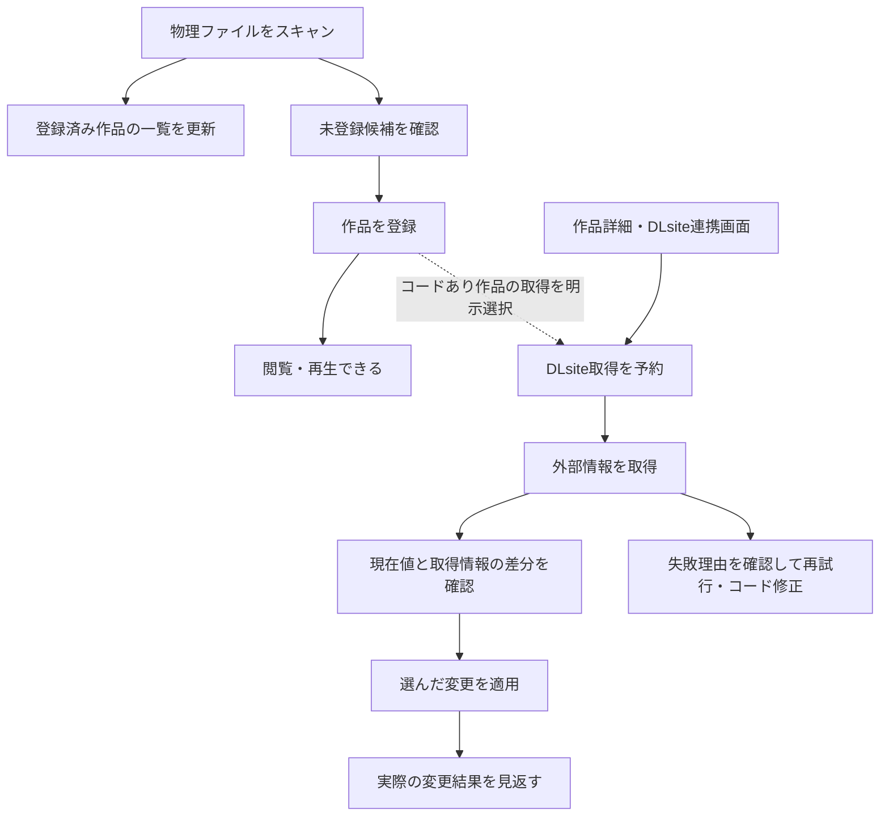

# スキャンとDLsite連携の調査・再設計案 2026-09-21

本書は現行フローの調査と仕様提案です。2026-09-22時点で、通常スキャンからの暗黙取得をやめること、差分確認後の明示適用、DLsite専用管理ビューを採用しました。採用したのはこの3点の方向性であり、細部の実装を確定する決定書ではありません。本書の調査と採用方針はTASK-451（Done）に紐づき、作品編集はDRAFT-47、一括取得の結果・refresh運用はDRAFT-63、残る利用者向け詳細仕様はDRAFT-74で扱います。

対象は `a37dfd54`。9月20〜21日のレビューを踏まえ、server/shared、clientの操作と表示、専用worktreeのフィクスチャを調査対象にしました。実ライブラリやDLsiteへの実通信は検証に使いません。コード参照の行番号はこのcommit基準です。

## 前提と結論

ユーザーから示された前提は以下です。

| 項目           | 採用したこと・確定していること                                                                           | 未決のこと                                         |
| -------------- | -------------------------------------------------------------------------------------------------------- | -------------------------------------------------- |
| 登録と再生     | DLsite連携は任意。取得を待たず再生できる。DLsiteにない作品も多数ある                                     | なし                                               |
| スキャンと取得 | 通常の物理スキャンからDLsite取得を暗黙起動しない。登録時にコードありをまとめて取得できる明示選択を設ける | 選択の初期値、具体的な配置、対象・待機・取消の細部 |
| 適用           | 取得情報は差分確認後に明示適用する。一括承認も用意する                                                   | 差分の保持期間、競合時の再確認の細部               |
| 長時間処理     | ブラウザのタブやセッションに依存しない                                                                   | サーバー再起動後の自動再開・結果保持               |
| 失敗からの復帰 | DLsite専用管理ビューを復帰先にする。作品詳細からの単体操作も残す                                         | ビューの配置・レイアウト、結果履歴の保持範囲       |

採用した方向は、ローカル作品の登録・再生を先に成立させ、登録時の明示選択または後からの単体操作でDLsite情報を取得し、差分を確認して適用する流れです。DLsite専用の管理ビューを、確認待ち・失敗・処理結果へ戻る場所にします。コードなしの作品を要対応扱いにしません。登録時の選択を既定でオンにするか、サーバー再起動後にどう扱うかは決めていません。

### 2026-09-22に採用した3点

1. 通常の物理スキャンからDLsite取得を暗黙起動しない。登録時にコードのある作品をまとめて取得する明示的な選択肢を設け、選ばなかった場合もDLsite管理ビューまたは作品詳細から取得できるようにする。
2. 取得情報は差分を確認してから明示的に適用する。一括承認を用意し、未設定項目だけの自動補完や外部情報への自動追随は採用しない。
3. 復帰先はDLsite専用管理ビューとする。作品詳細からの単体取得・差分確認・適用は残す。ビューの配置やレイアウトは未確定とする。

登録後すぐ再生できること、DLsite連携が任意であること、長時間処理がブラウザ非依存であることは引き続き前提である。登録時選択の初期値、コード取得失敗時にコードを保存するか、サーバー再起動後の自動再開、結果保持期間は今回決めていない。

既存レビューは、取得・正本保存・一覧反映を区別するための土台を整理しています。今回必要なのは、その契約をユーザーの操作と結びつけることです。画面の都合だけで保存契約を決めず、既存APIの都合だけで操作手順も決めません。

## 現行フローと確認できた問題

### 現行の処理と入口

| 操作                     | 現行の処理                                                                                                     | 採用方針・利用者が判断すること                               |
| ------------------------ | -------------------------------------------------------------------------------------------------------------- | ------------------------------------------------------------ |
| スキャン                 | 既存metaを一覧へ反映し、metaのない音声フォルダーを未登録候補にする。条件付きで推定RJコードを既存metaへ保存する | スキャンは物理状態の確認に限定し、DLsite取得を暗黙に始めない |
| 候補登録・手動登録       | 現行はローカル作品を作って一覧へ反映し、登録成功を契機にDLsite取得を予約する                                   | 登録後にコードあり作品をまとめて取得するか、明示的に選択する |
| 通知・設定からの一括取得 | 未適用・非除外でコードのある作品を取得。cacheと表示用状態を更新する                                            | 専用管理ビューから取得・確認・再試行へ戻り、適用とは分ける   |
| 作品詳細からの取得       | 一作品の情報と、取得後に読んだsource revisionを返す                                                            | 単体操作は残し、表示した差分を確認してから適用する           |
| 単体適用                 | 選択したタイトル・タグ・URL・カバーを正本へ保存して一覧へ反映                                                  | 既存値の追加・置換範囲を差分で確認する                       |
| 未設定項目の一括適用     | プレビューでも必要に応じて外部取得。適用時にも差分を再計算する                                                 | 未設定のみの自動補完ではなく、差分をまとめて明示承認する     |

登録後にDLsite取得を待たず作品を利用できる構造は、すでにあります。これを新たに実現しなければならない欠陥として数えません。scanとDLsite bulkも別のサーバージョブになっています。今回の採用判断では、通常スキャンからの暗黙起動を外し、登録時の明示選択と専用管理ビューへつなぐことにしました。残る問題は、表示、結果、単体操作との寿命を利用者から見て一貫させることです。

根拠: [scanと登録](../server/src/adapters/real/scanner.ts)、[自動起動の配線](../server/src/app.ts)、[DLsiteのHTTP入口](../server/src/routes/dlsite.ts)。

### 既知の問題を今回具体化したもの

| ID  | 問題と影響                                                                                                                                 | 根拠                                                              |
| --- | ------------------------------------------------------------------------------------------------------------------------------------------ | ----------------------------------------------------------------- |
| F1  | スキャン・再投影が推定コードを正本へ書く。表示反映だけのやり直しでも、作品情報の変更を伴い得る                                             | S3の再確認。`scanRegister.ts:101`、`meta.ts:354`                  |
| F2  | スキャン完了時の候補と、登録・除外後の現在候補が別に存在する。「今回見つかった件数」と「いま登録できる件数」が混ざる                       | S5の再確認。`shared/src/scan.ts:63`、`settingsScanMethods.ts:118` |
| F3  | 一括取得は全コードの通信後に作品別進捗を出す。長い通信中はprogressがnullになり得る。通信中に取消するとcache保存済みでも結果は0件になり得る | S6の具体化。`dlsiteBulk.ts:167`・`:190`                           |
| F4  | 自動要求は待機列へ入り、手動開始は実行中なら拒否される。利用者に見えない待機分も取消で破棄される                                           | 既知の非対称性を具体化。`dlsiteJobManager.ts:90`・`:119`・`:161`  |
| F5  | 一括適用は選択work IDだけを送り、実行時に差分を作り直す。確認した内容と実際の変更がずれる可能性がある                                      | 共通契約4の具体化。`dlsiteMethods.ts:80`・`:125`                  |

この表と以下の表の短いサーバーファイル名は、特記のない限り `server/src/adapters/real/` 配下です。`dlsiteJobManager.ts` は `server/src/` 配下です。

F3の「0件」は、作品別集計前の取得成功・失敗・パース失敗件数です。対象外のskipped件数は対象選定時に加算されるため、取消結果のすべての数値が必ず0になるという意味ではありません。

### 追加で明らかになった問題

| ID  | 確認したこと                                                                                                         | ユーザーフローへの影響                                                                             |
| --- | -------------------------------------------------------------------------------------------------------------------- | -------------------------------------------------------------------------------------------------- |
| F6  | 取得成功でも未適用ならstatusはnone。コードあり・noneが未連携の集計対象                                               | 未取得と確認待ちを区別できず、取得成功後にも「まとめて取得」が次の操作として残る                   |
| F7  | 現行の候補登録は成功一作品ごとに自動ジョブを投入する。コードなしでも投入後にskipする。待機対象はsnapshotに含まれない | 現行の細切れ起動は、採用した「登録時にコードあり作品をまとめて取得する明示選択」へ揃える対象である |
| F8  | DLsite結果は集計値中心で、ジョブID・起動理由・対象作品別の結果を持たない。現在または最後のジョブだけをメモリに持つ   | 「どの登録から始まった取得か」「失敗分・未処理分はどれか」を結果画面だけでは復元できない           |
| F9  | 一括取得はサーバージョブだが、単体fetch/applyはHTTP requestのabort signalに接続され、一括適用は同期HTTP              | 操作によって閉じる・再接続・結果回収の意味が異なる                                                 |
| F10 | 単体適用は204、一括適用は件数を返し、成立した変更前後を残さない。コード変更でappliedTagsは消えるが適用済みの値は残る | 上書きされた内容や、旧コード由来の値を後から説明できない                                           |
| F11 | 単体fetchでコードを読んで取得した後、別の読取りで最新revisionを返す                                                  | 取得中にコードを変更すると、旧コードの情報と新revisionの組合せを承認できる経路がある               |
| F12 | metaのapplied/skippedがcacheの取得失敗より優先して作品状態へ投影される                                               | 適用済み作品の再取得失敗が、作品の現在のstatusからは分からない                                     |
| F13 | root変更とDLsite適用に共通の排他・対象検証がなく、適用先はcatalogのmeta pathから得る                                 | root変更後、旧rootの作品情報を変更できる経路が残る                                                 |
| F14 | 一括取得の完了から開く未設定項目プレビューは、直前に取得した作品へ対象を限定しない                                   | 「取得N件の続きを適用する」と思って進むと、別の作品も適用候補に出る                                |

F6・F12の根拠は [状態の投影](../server/src/adapters/real/dlsiteProjection.ts) の59行目付近と [共有の状態判定](../shared/src/dlsite.ts)。F7は [候補登録コールバック](../server/src/adapters/real/scanCandidateSession.ts) の76行目付近と `app.ts:61`。F8は [ジョブ管理](../server/src/dlsiteJobManager.ts) と `shared/src/dlsite.ts:349`・`:388` にあります。

F9は `server/src/routes/dlsite.ts:76`・`:99`・`:122` が根拠です。request signalの配線は静的に確認しましたが、タブを閉じたときにBunとブラウザがいつabortへ伝えるかは別の検証が必要です。一括適用にはsignalが渡されず、接続が切れても続く可能性があります。いずれも、接続が切れたことを「正本は保存されなかった」という証拠にはできません。

F10・F11は [適用内容の保存](../server/src/adapters/real/dlsitePersist.ts) の39行目付近、[取得](../server/src/adapters/real/dlsiteMethods.ts) の58行目付近、`server/src/routes/dlsite.ts:81` が根拠です。F11の成立条件は、旧コードで取得を開始し、取得中に別操作でコードを変更し、その後fetch応答が新revisionを返すことです。そのrevisionで旧情報をapplyすると、CASを通って旧コードを書き戻せる構造です。実操作で競合を再現した結果ではなく、コード上の経路として確認しています。

F13は `server/src/routes/settings.ts:16` と `dlsitePersist.ts:31` が根拠です。候補登録にはroot fingerprintの照合があるため、「アプリ全体にroot検証がない」という指摘ではありません。

F14は `client/src/features/dlsite/ui/DlsiteBulkRuntime.tsx:57` 付近の完了アクションと、`dlsiteMethods.ts:125` 以降のプレビュー対象選択が根拠です。フィクスチャでは「取得8件」のあとに「適用対象9件」を確認しました。既に取得・適用した作品を対象に含めること自体が誤りなのではなく、直前の処理の続きなのか全作品からの補完なのかを区別していないことが問題です。

### 画面側で分かった具体的な不一致

- コードなしにも違いがあります。`rjCode: null` は「RJコード未検出」の警告対象ですが、候補登録で明示的な空文字を送った場合は対象外です。DLsiteを使わない意思が、nullと空文字の違いに埋め込まれています。コードなしが正常という方針をUI・APIで明示する方が分かりやすいです（`shared/src/dlsite.ts:40`、`UnregisteredTab.tsx:214`、`WorkStatusWarnings.tsx:76`）。
- 「連携しない」にした作品でもコードが残っていると、スキャン結果の外部連携列では「取得待ち」になります。連携意思と取得状態を分ける必要性が、表示の不一致としても現れています（`shared/src/dlsite.ts:73`、`client/src/features/scan/ui/scanModal/dlsiteLinkStatus.ts:5`）。
- DLsite runtimeにはsnapshotへ再接続するattach処理がありますが、マウント時には自動実行されず、確認できた明示呼出しはスキャン完了時です。候補登録・Files登録からサーバーが自動取得を始める経路と、画面が進捗へ接続する経路が揃っていません。サーバーで続くことだけでは、再訪時に処理を見つけられる保証になりません（`DlsiteBulkRuntime.tsx:115`、`client/src/features/scan/ui/ScanRuntime.tsx:53`）。
- 単体適用には現在値との比較がありますが、一括プレビューのデータは追加タグ・カバー適用有無・URL適用有無が中心で、現在値を持ちません。既存の単体UIを基に、同じ承認の意味へ揃える余地があります（`shared/src/dlsite.ts:272`、`client/src/features/dlsite/ui/DlsiteBulkApplyDialog.tsx:46`）。
- タイトル・URLの編集draftは、作品propsが更新されると再設定されます。DLsite適用後の再取得と同じ編集画面で動くため、未保存入力を保持する境界が必要です。Files登録にも取得完了時にタイトルを入力へ取り込む経路があります（`client/src/features/library/ui/preview/WorkEditDialog.tsx:146`、`DlsiteEditor.tsx:258`、`client/src/features/files/ui/RegisterWorkDialog.tsx:56`）。これは既存の編集契約レビューと重なる論点です。
- 個別のパース失敗と、一定割合を超えた構造変更の警報が混ざっています。また、通知一覧の取得エラーを空一覧と区別するUIが不足しています。連携画面では、作品ごとの失敗、サービス全体の警報、一覧の読込み失敗を別に示す必要があります（`shared/src/dlsite.ts:86`、`client/src/features/dlsite/model/useDlsiteNotificationList.ts:18`、`client/src/features/dlsite/ui/NotificationListModal.tsx:56`）。

この節の短いclientファイル名は、`UnregisteredTab.tsx` が `client/src/features/scan/ui/scanModal/`、`WorkStatusWarnings.tsx` と `DlsiteEditor.tsx` が `client/src/features/library/ui/preview/`、`DlsiteBulkRuntime.tsx` が `client/src/features/dlsite/ui/` 配下です。画面側の不一致は静的確認であり、すべてをブラウザで再現したという意味ではありません。

### 文書と実装の食い違い

現行の一括取得はcacheの取得と表示用状態の更新だけで、タイトル・タグ・URL・カバーを自動適用しません。`new` / `existing` は現行bulkではログ以外に使われません（`dlsiteBulk.ts:148` 以降）。[DLsiteの説明](dlsite.md)の「newは全タグ適用、existingは差分適用」「一括取得成功でappliedへ遷移」は旧仕様です。

DRAFT-63の「TTL切れで通常一括から自然に取り直される」も、適用済み作品には当てはまりません。通常一括はapplied/skippedを対象外にするためです。

また、[デザインシステム](design-system.md)には直近結果APIと通知ベルからDLsite結果を確認できるとありますが、APIで保持される結果、現在の失敗一覧、UIで任意に開ける過去結果は同じものではありません。今回の実操作では、通知から現在の失敗一覧は開けましたが、任意に直近ジョブの完了結果を開く入口は見つかりませんでした。

## 採用したユーザーフロー

### 登録から再生まで

スキャンの目的は、ファイルの観測、登録済み作品の検証・一覧更新、未登録候補の発見です。既存metaに推定コードを書き足したり、スキャン成功の条件に外部取得を含めたりしません。候補には推定コードを示し、登録時に採用するか判断できます。

登録完了時には「N作品を登録しました」と、再生・作品表示への入口を示します。DLsite取得の成否で登録を失敗扱いに戻しません。コードがなくても登録できます。

登録時に「コードのある作品をまとめてDLsite取得する」という明示的な選択肢を設けます。選択した有効コードの作品だけを、登録バッチの終了後にまとめて予約します。選択の初期値をオンにするか、前回選択を覚えるかは未決であり、無条件・既定オンの自動取得を採用したものではありません。

現行のFiles登録には、登録前の「DLsite連携（任意）」から取得して入力を補完する経路もあります。これは作品単体の明示操作として残します。取得完了が入力済みのタイトルを黙って置き換えない細部、通信失敗時のコード保存は未決です。登録を先に完了した場合も、取得結果は閉じたダイアログだけに残さず、登録された作品の確認待ちへ引き継ぎます。

通常スキャンからの暗黙の取得要求は外します。スキャンで既存metaを初めて発見した作品も、登録済み作品としてすぐ使えます。DLsite情報が必要なら、登録時の明示選択、連携管理ビュー、作品詳細の単体操作から開始します。スキャン後の自動取得を残す案は今回採用していません。

### DLsiteを使わない作品

コード未設定は通常の状態です。コードなしというだけでは通知数を増やしません。作品詳細では「DLsite連携を設定」から任意に開始できます。

「連携しない」は自動取得の対象から外す意思であり、ライブラリからの削除、候補フォルダーの除外、取得情報の破棄とは別です。すでに適用したタイトルやタグを勝手に消しません。ユーザーが取得を希望したのにコードが不明な場合だけ、その操作内でコード入力を案内します。

### 取得と結果への復帰

DLsite連携の専用管理ビューに、進行中・待機中の取得、取得済みの確認待ち、取得失敗、直近の処理結果を置きます。作品詳細、登録完了、通知ベルから同じビューへ移動でき、常設入口からも開けるようにします。専用ビューを復帰先にする方向は採用しましたが、画面の位置やレイアウトは未確定です。

スキャン画面はローカル処理の結果とDLsite側へのリンクを示すだけにします。通知ベルとトーストは入口であり、結果の唯一の保存場所にしません。日常的な取得・確認・再試行は専用管理ビューに集め、作品詳細からの単体操作は残します。設定画面を常設入口として使うかはレイアウトと併せて未確定です。

一作品の差分確認は作品詳細からその場で開けても構いません。専用ビューへ毎回移動させることが目的ではなく、どの入口から始めても同じ状態と結果に戻れることを揃えます。

タブを閉じたり再読込したりしても、サーバーで実行中の処理は継続します。再入場時にはサーバーから現在の処理と結果を取得し、ブラウザが過去の進捗イベントを全部受け取ったことを前提にしません。

### 取得情報の確認と適用

確認画面には、現在値、取得値、今回の変更を並べます。項目ごとの「維持」「追加」「置換」を示し、変更のない項目は適用件数に数えません。一括確認でも同じ差分表現を使います。

| 項目                       | 採用した既定の扱い                                                                  |
| -------------------------- | ----------------------------------------------------------------------------------- |
| タイトル                   | 現在のタイトルを維持。フォルダー由来でも、空欄と同じ扱いで自動置換しない            |
| 単一値のタグ分類           | 未設定なら追加候補。同じ分類に別の値があれば、置換前後を示して選択                  |
| 複数値のタグ分類・自由タグ | 新しく加えるタグを示す。DLsiteにないことを理由に既存タグを削除しない                |
| カバー                     | 未設定なら追加候補。既存画像があれば画像同士を比較して置換を選択                    |
| URL                        | 追加・置換・維持するURLを列挙する。同じドメインという理由だけで黙って一括削除しない |

「未設定項目をまとめて適用」は、上の方針で作った差分をまとめて明示承認する操作として採用します。画面で見た差分を承認するなら、実行時に差分が変わった作品は適用せず再確認へ戻します。「実行時点の未設定項目を埋める」という別契約は今回採用しません。

適用結果では、実際に保存した変更前後と、変更しなかった項目、競合・未処理・一覧反映の失敗を示します。ここでの変更記録は、その操作が成立させた内容です。後から手編集した現在値や、値の恒久的な由来を保証する記録ではありません。

カバーの変更前後まで後から比較できると約束する場合は、可変のファイルパスだけでなく、結果の保持期間中に参照できる比較用サムネイルなどを残します。画像の元ファイル全体をundo用に保管することまでは要求しません。

差分がなければ「変更なし」とし、確認待ちに数えません。一部だけ採用した場合は、残りを未完了として強制的に残さず、「今回は使わない」でその候補の確認を終えられるようにします。これは作品全体の「連携しない」とは別です。新しい情報を明示取得したときは、あらためて差分を確認できます。

### コード修正と取得情報の更新

コード入力と取得開始を一つの明示操作にまとめる案はDRAFT-47と対応する候補です。コードも保存されるか、通信失敗時にコードを保持するか、コード保存失敗と取得開始失敗をどう分けるかは今回決めていません。採用したのは、取得を暗黙に始めず、ユーザーが選んだ取得を差分確認へ進める境界です。

コード変更は、既存のタイトル・タグ・カバーを自動で消す操作にはしません。旧コードの取得候補を現在作品へ適用できない状態にし、新しい取得内容との比較へ進めます。取得中にコードが再変更されたら、旧コードの結果はcacheとして利用できても、その作品の確認待ちへは結びつけません。

適用済み作品にも明示的な「最新情報を取得」を用意し、情報の取得と再適用を分けます。通常の未取得作品向け操作に、適用済み作品の更新を混ぜません。作品詳細からの単体操作は残し、専用管理ビューから複数作品を選んで取得・確認できるようにします。全作品の定期refreshや外部情報への自動追随は採用しません。

### 失敗・取消後

| 状況                               | 見せること                                                         | 次の操作                                         |
| ---------------------------------- | ------------------------------------------------------------------ | ------------------------------------------------ |
| 通信失敗                           | 失敗した作品と理由。前回成功した情報があるなら取得日時とともに示す | 失敗分だけ再試行。古い情報を使うならその旨を確認 |
| 作品が見つからない                 | 試行したコード                                                     | コード修正、後で再試行、連携しない               |
| ページ解析失敗                     | 取得はできたが情報を読めないこと                                   | 内容確認、修正後の再解析。通信再実行と区別       |
| 手編集・コード・対象rootが変わった | 確認に使った前提が変わったこと                                     | 最新状態から差分を作り直す                       |
| 取得を取消                         | 完了した作品と、止めた未処理作品                                   | 未処理分を再度取得                               |
| 適用を取消                         | 保存済みの変更は残ることと未処理作品                               | 未処理分を再確認して適用                         |
| 正本保存済み・一覧反映失敗         | 保存済みであること                                                 | 一覧への反映をやり直す。再取得・再適用しない     |
| 通信断などで適用結果不明           | 成功とも失敗とも確定していないこと                                 | サーバーの結果と現在の正本を確認。自動再送しない |

## 比較したい仕様案

### 情報の自動適用

| 案                           | 得られる体験                                             | 注意点                                                                                           | 今回の採否   |
| ---------------------------- | -------------------------------------------------------- | ------------------------------------------------------------------------------------------------ | ------------ |
| 差分確認後に明示適用         | 上書き内容を事前に判断できる。単体・一括で同じ意味になる | 確認待ちをまとめて扱える画面が必要                                                               | 採用         |
| 未設定項目だけ自動補完       | 初回取り込みの手数を減らせる                             | タイトル、タグの分類、既存カバーの「未設定」を定義する必要がある。追加でも一覧の分類結果が変わる | 今回は不採用 |
| 過去のDLsite適用値を自動更新 | 外部情報の更新に追随できる                               | 手編集との区別、削除したタグの再追加、コード変更、項目ごとの由来が必要                           | 今回は不採用 |

いずれも、実際に変更された内容を後から見返す要求は残ります。「空欄だけなら安全」という理由だけで自動補完を既定にしません。

明示確認案への反証は、大量に取り込むたび、ほぼ同じ確認を繰り返す可能性です。今回の採用では一括承認で確認単位をまとめます。未設定のみの自動補完は代替案として比較したが、既存値の意味を曖昧にし、誤情報も設定済みとして残るため採用しません。既存値を修正する場合も明示適用を使います。

### 結果の置き場所

| 案                             | 評価                                                                                   | 今回の採否                       |
| ------------------------------ | -------------------------------------------------------------------------------------- | -------------------------------- |
| DLsite専用の管理ビュー         | 取得・確認・再試行・結果を一つの入口で扱える。長時間処理と複数作品の比較に向く         | 採用                             |
| 通知ベルと複数のモーダルを拡張 | 小規模な単発操作には合うが、取得中と確認待ちを往復する導線を別に整える必要がある       | 入口として残すが主画面にはしない |
| スキャン画面へ統合             | 登録直後は連続して見えるが、コード修正や適用済み作品の更新をスキャンに結びつけてしまう | 不採用                           |

## UIを支える内部契約

### 状態と処理単位

作品の登録状態、DLsite連携の意思とコード、外部取得の結果、取得情報の適用状況、ジョブの実行状態を分けます。これらを一つのenumに詰めません。すべての組み合わせを画面へ露出する必要はなく、「適用済みだが最新取得は失敗」「取得済みで確認待ち」を区別できればよいです。

取得ジョブはID、起動理由、対象作品と処理対象コード、開始・終了時刻、作品別の結果を持ちます。同一コードの通信は共有しつつ、利用者に見せる完了件数は作品単位と明示します。取得・作品への状態反映・結果確定を順に行い、全通信終了まで最初の進捗が出ない構成を改めます。

登録時に明示された取得要求と作品詳細からの手動要求は同じ待機規則に揃える案を提案します。実行済み・実行中の対象へ無言で追加して分母を動かすより、重複を除いた次の取得バッチとして予約する方が分かりやすいと考えます。取消が「この処理」か「待機分も含むすべて」かを操作名と結果で区別することも未決の内部契約です。

### 差分と承認の基準

差分は、一度に読み取った正本の値とrevision、固定した取得候補から作ります。適用時には作品ID・root・コード・正本revisionと承認した候補が一致するか確認します。最新revisionだけを後付けして、古い表示値や別コードの候補を承認しません。

取得候補の保持期限と、外部HTTPを再試行してよい時刻は別です。HTTP cacheの期限が切れただけで確認中の内容を黙って差し替えません。候補が失われた場合は、取得し直して再確認することを示します。

画像まで含めて外部通信なしで適用できると約束するなら、確認できる取得候補にはカバーの実体も必要です。HTML取得だけ終わった状態を、カバーを含む適用準備完了と呼びません。

編集中の作品へ取得候補を取り込む場合は、編集draftへ取り込んで通常保存に進むか、編集を保存・破棄してから独立した適用に進むかを選びます。両方の保存経路を同じ画面で同時に動かしません。

### ブラウザ非依存と結果保持

長時間になり得る取得・一括適用はサーバーが所有し、HTTP応答やSSEの接続寿命を処理寿命にしません。ブラウザは開始・確認・取消を要求し、再接続後は現在のsnapshotを取得します。

サーバー再起動後の扱いは今回決めていません。確認待ちの候補、処理結果の保持範囲、実行途中の処理を「中断・要確認」とするか、自動再開するかは別途決めます。無人での自動再開や適用操作の自動再送を採用したとは扱いません。

正本ファイルへの保存と結果DBへの記録は単一のトランザクションではありません。途中でサーバーが止まった場合、結果記録がないことを未保存の証拠にしません。現在の正本を確認して、分かる範囲を表示します。

直近結果の保持上限は未決です。確認待ち作品は直近ジョブ結果とは別の現在状態として扱い、結果の整理だけで消しません。古い適用結果を削除する場合は、変更前後をいつまでも見返せるとは約束しません。全取得履歴、全meta版の保管、自動undoはこの提案の必須要件ではありません。

### 土台設計との関係

以下は、DLsite側と土台側で採用を検討する設計原則です。現行実装ですべて成立しているわけではなく、source snapshotの一体化や適用時のroot検証などは追加する契約です。

| 土台側の判断                          | DLsite側で必要になること                       |
| ------------------------------------- | ---------------------------------------------- |
| source snapshotとrevisionを一体で取得 | 現在値・差分・承認の基準を揃える               |
| 投影で正本を追加変更しない            | 反映の再試行でコードや適用内容を変えない       |
| source保存・catalog公開・応答を区別   | 保存済みを未保存として再実行しない             |
| rootと作品identityの境界              | 旧rootや別作品へ取得結果を適用しない           |
| 編集UIの保存方式                      | 未保存の入力を背景取得や独立適用で上書きしない |

検索仕様の全面見直しや、全ジョブ共通の汎用フレームワークは、この導線設計の前提にしません。既存のレート制限、通信上限、単体meta保存のCAS、候補登録時のroot fingerprint検証は維持し、DLsite適用で不足している対象検証を追加します。

## 検証の範囲と資料

### 実操作で確認したこと

専用worktree `.worktrees/task-451` の `new-work` フィクスチャを、`http://task-451-dlsite-flow.mimi.localhost:1355` で操作しました。実データDB、実DLsite通信は使っていません。

| 場面                   | 手順と観測結果                                                                                  | 評価                                                                                       |
| ---------------------- | ----------------------------------------------------------------------------------------------- | ------------------------------------------------------------------------------------------ |
| スキャンと候補登録     | スキャン画面の未登録2件を登録。未登録0件・新規登録済み2件となり、一覧は11作品から13作品になった | 登録・取得は分離できている。候補と結果の説明を整える余地がある                             |
| DLsiteコードなしの再生 | 新登録の「未登録作品」で「最初から再生」を実行し、Track 1がプレイヤーへ入った                   | 登録後にDLsiteを待たず再生する要求は、少なくともこのfixtureの操作経路では満たせている      |
| 失敗からの復帰         | 通知「DLsite取得失敗」→失敗一覧→作品詳細→「連携設定を編集」→「取得結果を確認」                  | 復帰経路は存在するが、一覧・詳細・編集・プレビューをまたぐ                                 |
| 単体適用               | タイトルの変更前後、URLの「同一」、カバーの「対象外」、追加タグを確認し、選択して適用           | 差分UIは既にある。新設だけでなく、これを入口間で揃える設計が必要                           |
| 一括取得と適用         | 「まとめて取得」で取得8件の通知。そこから未設定項目の対象9件を確認し、9件を適用                 | 取得と適用は別操作。対象集合の違いは分かりにくい                                           |
| 結果を閉じた後         | 完了通知を閉じ、通知ベル・設定を開いた                                                          | 現在の失敗一覧や取得・適用の入口はあるが、直近の作品別処理結果へ戻る画面は見つからなかった |
| 再読込・別タブ         | 再読込で作品選択と変更済み値が復元。別タブでも13作品と適用済みの値を確認                        | 完了後のデータ再取得は確認。実行途中のタブ切断・継続を検証したことにはならない             |

証拠画像は [登録結果](assets/dlsite-flow-review-2026-09-21/09-scan-register-result.png)、[コードなし作品の再生](assets/dlsite-flow-review-2026-09-21/21-code-less-immediate-play.png)、[一括適用プレビュー](assets/dlsite-flow-review-2026-09-21/25-bulk-apply-preview.png)、[適用結果](assets/dlsite-flow-review-2026-09-21/26-bulk-apply-result.png)、[別タブの通知](assets/dlsite-flow-review-2026-09-21/31-new-tab-notifications.png)です。

### 未検証とフィクスチャの限界

スキャンと一括取得が短時間で終わるため、長時間通信中の進捗、実行中の取消、タブを閉じたままの処理継続、通信断からの再接続、サーバー再起動は実操作で確認できていません。サーバージョブの所有者・signalの配線・結果の保持範囲は静的調査です。F11の競合、F13のroot変更も実データで再現させていません。

フィクスチャでは、適用後も失敗表示や未連携件数が残りました。原因も静的に確認できました。fixtureの適用はタグなどを更新しますが、dlsite.statusをappliedへ更新せず、通知はその状態を直接集計しています（`server/src/adapters/fixture/dlsiteMethods.ts:61`・`:104`、`server/src/adapters/fixture/works.ts:77`）。realはmetaへappliedを保存して投影するため、この観測をrealの不具合として数えません。また、今回のコードなし新登録作品の詳細にはDLsite警告は表示されませんでした。「コードなしなら必ず全画面で警告される」という断定はしません。

合成音声で確認したのは、再生操作、プレイヤー状態、再開表示です。実音声の品質や長時間のシーク感は対象外です。動画取得は環境のffmpeg不足で完了せず、証拠は画面のsnapshotと上記のスクリーンショットです。

調査・提案文書のみの変更で、アプリのコードとUIは変更していません。フルテストとsmokeは実行していません。残る詳細仕様と実装の分割はBacklogで扱います。

server/sharedの調査と仕様案比較をSol（medium）、clientの静的調査・フィクスチャ操作・独立した事実確認をLuna（max）へ分担し、統括が文書へ統合しました。事実確認では、bulkの副作用、候補ごとの自動起動、進捗と取消、コード変更競合、request signal、root変更を再照合しました。タブ切断の実動作など、静的確認で保証できない条件は本文に残しています。

## 2026-09-22時点の採用判断

ユーザー確認を受け、次の3点を方向性として採用した。ここで決めたのは導線と操作の境界であり、実装方式や詳細レイアウトではない。

1. 通常の物理スキャンからDLsite取得を暗黙起動しない。登録時にコードのある作品をまとめて取得する明示的な選択肢を設ける。選ばなかった場合も、DLsite専用管理ビューまたは作品詳細から取得できるようにする。
2. 取得情報は差分を確認してから明示的に適用する。一括承認を用意し、未設定項目だけの自動補完や外部情報への自動追随は採用しない。
3. 復帰先はDLsite専用管理ビューとする。作品詳細からの単体取得・差分確認・適用は残す。ビューの配置とレイアウトは未確定とする。

登録後すぐ再生できること、DLsite連携が任意であること、長時間処理がブラウザ非依存であることは前提として維持する。登録時選択の既定値、コード取得失敗時のコード保存、サーバー再起動後の自動再開、結果保持期間、管理ビューの詳細配置は今回決めていない。

登録時選択の初期値・前回記憶、管理ビューの配置・レイアウト、サーバー再起動後の扱い、直近取得結果の保持上限、一括承認の選択粒度・対象集合はDRAFT-74で追跡する。差分確認後の明示適用と一括承認の採用、および自動補完・自動追随の不採用は決定済みである。
