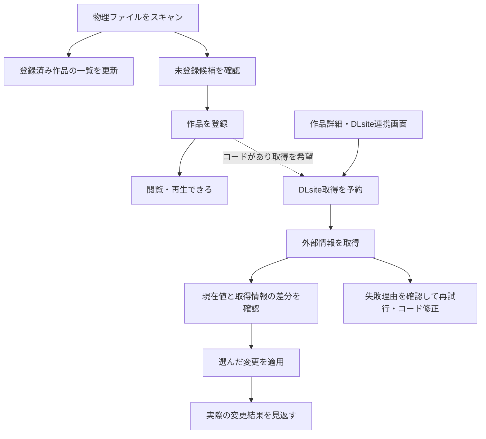

# スキャンとDLsite連携の調査・再設計案 2026-09-21

本書は現行フローの調査と仕様提案です。提案は未採用で、実装を変更する決定書ではありません。調査管理と残る仕様判断はBacklogのTASK-451、作品編集はDRAFT-47、一括取得の運用はDRAFT-63で扱います。

対象は `a37dfd54`。9月20〜21日のレビューを踏まえ、server/shared、clientの操作と表示、専用worktreeのフィクスチャを調査対象にしました。実ライブラリやDLsiteへの実通信は検証に使いません。コード参照の行番号はこのcommit基準です。

## 前提と結論

ユーザーから示された前提は以下です。

| 項目 | 確定していること | 未決のこと |
| --- | --- | --- |
| 登録と再生 | DLsite連携は任意。取得を待たず再生できる。DLsiteにない作品も多数ある | なし |
| スキャンと取得 | 物理スキャンと外部スクレイピングは別処理にする | 自動取得の起動条件と設定 |
| 適用 | 既存情報がどう上書きされる／されたか確認できると嬉しい | 自動適用か、確認後に適用するか |
| 長時間処理 | ブラウザのタブやセッションに依存しないことが望ましい | サーバー再起動後の自動再開まで必要か |
| 失敗からの復帰 | 後から続きをできる導線が必要 | 戻る場所と結果の保持範囲 |

推奨は、ローカル作品の登録・再生を先に成立させ、DLsite情報は別の取得ジョブで用意し、差分を確認して適用する流れです。DLsite専用の管理ビューを、確認待ち・失敗・処理結果へ戻る場所にします。コードなしの作品を要対応扱いにしません。

既存レビューは、取得・正本保存・一覧反映を区別するための土台を整理しています。今回必要なのは、その契約をユーザーの操作と結びつけることです。画面の都合だけで保存契約を決めず、既存APIの都合だけで操作手順も決めません。

## 現行フローと確認できた問題

### 現行の処理と入口

| 操作 | 現行の処理 | 利用者が判断する必要のあること |
| --- | --- | --- |
| スキャン | 既存metaを一覧へ反映し、metaのない音声フォルダーを未登録候補にする。条件付きで推定RJコードを既存metaへ保存する | ファイル確認だけなのか、情報が書き換わるのか |
| 候補登録・手動登録 | ローカル作品を作って一覧へ反映。登録成功を契機にDLsite取得を予約する | 登録完了と情報取得完了が別であること |
| 通知・設定からの一括取得 | 未適用・非除外でコードのある作品を取得。cacheと表示用状態を更新する | 取得後に別途適用が必要であること |
| 作品詳細からの取得 | 一作品の情報と、取得後に読んだsource revisionを返す | 表示した情報をどの作品の版へ適用するか |
| 単体適用 | 選択したタイトル・タグ・URL・カバーを正本へ保存して一覧へ反映 | 既存値の追加・置換範囲 |
| 未設定項目の一括適用 | プレビューでも必要に応じて外部取得。適用時にも差分を再計算する | 見た差分を固定して承認しているわけではないこと |

登録後にDLsite取得を待たず作品を利用できる構造は、すでにあります。これを新たに実現しなければならない欠陥として数えません。scanとDLsite bulkも別のサーバージョブになっています。今回の問題は、暗黙の起動、表示、結果、単体操作との寿命の違いが、利用者から見て一貫していないことです。

根拠: [scanと登録](../server/src/adapters/real/scanner.ts)、[自動起動の配線](../server/src/app.ts)、[DLsiteのHTTP入口](../server/src/routes/dlsite.ts)。

### 既知の問題を今回具体化したもの

| ID | 問題と影響 | 根拠 |
| --- | --- | --- |
| F1 | スキャン・再投影が推定コードを正本へ書く。表示反映だけのやり直しでも、作品情報の変更を伴い得る | S3の再確認。`scanRegister.ts:101`、`meta.ts:354` |
| F2 | スキャン完了時の候補と、登録・除外後の現在候補が別に存在する。「今回見つかった件数」と「いま登録できる件数」が混ざる | S5の再確認。`shared/src/scan.ts:63`、`settingsScanMethods.ts:118` |
| F3 | 一括取得は全コードの通信後に作品別進捗を出す。長い通信中はprogressがnullになり得る。通信中に取消するとcache保存済みでも結果は0件になり得る | S6の具体化。`dlsiteBulk.ts:167`・`:190` |
| F4 | 自動要求は待機列へ入り、手動開始は実行中なら拒否される。利用者に見えない待機分も取消で破棄される | 既知の非対称性を具体化。`dlsiteJobManager.ts:90`・`:119`・`:161` |
| F5 | 一括適用は選択work IDだけを送り、実行時に差分を作り直す。確認した内容と実際の変更がずれる可能性がある | 共通契約4の具体化。`dlsiteMethods.ts:80`・`:125` |

この表と以下の表の短いサーバーファイル名は、特記のない限り `server/src/adapters/real/` 配下です。`dlsiteJobManager.ts` は `server/src/` 配下です。

### 追加で明らかになった問題

| ID | 確認したこと | ユーザーフローへの影響 |
| --- | --- | --- |
| F6 | 取得成功でも未適用ならstatusはnone。コードあり・noneが未連携の集計対象 | 未取得と確認待ちを区別できず、取得成功後にも「まとめて取得」が次の操作として残る |
| F7 | 候補登録は成功一作品ごとに自動ジョブを投入する。コードなしでも投入後にskipする。待機対象はsnapshotに含まれない | まとめて登録した結果が細切れになり、最後の空振りジョブが直前の有意な結果を置き換え得る |
| F8 | DLsite結果は集計値中心で、ジョブID・起動理由・対象作品別の結果を持たない。現在または最後のジョブだけをメモリに持つ | 「どの登録から始まった取得か」「失敗分・未処理分はどれか」を結果画面だけでは復元できない |
| F9 | 一括取得はサーバージョブだが、単体fetch/applyはHTTP requestのabort signalに接続され、一括適用は同期HTTP | 操作によって閉じる・再接続・結果回収の意味が異なる |
| F10 | 単体適用は204、一括適用は件数を返し、成立した変更前後を残さない。コード変更でappliedTagsは消えるが適用済みの値は残る | 上書きされた内容や、旧コード由来の値を後から説明できない |
| F11 | 単体fetchでコードを読んで取得した後、別の読取りで最新revisionを返す | 取得中にコードを変更すると、旧コードの情報と新revisionの組合せを承認できる経路がある |
| F12 | metaのapplied/skippedがcacheの取得失敗より優先して作品状態へ投影される | 適用済み作品の再取得失敗が、作品の現在のstatusからは分からない |
| F13 | root変更とDLsite適用に共通の排他・対象検証がなく、適用先はcatalogのmeta pathから得る | root変更後、旧rootの作品情報を変更できる経路が残る |

F6・F12の根拠は [状態の投影](../server/src/adapters/real/dlsiteProjection.ts) の59行目付近と [共有の状態判定](../shared/src/dlsite.ts)。F7は [候補登録コールバック](../server/src/adapters/real/scanCandidateSession.ts) の76行目付近と `app.ts:61`。F8は [ジョブ管理](../server/src/dlsiteJobManager.ts) と `shared/src/dlsite.ts:349`・`:388` にあります。

F9は `server/src/routes/dlsite.ts:76`・`:99`・`:122` が根拠です。request signalの配線は静的に確認しましたが、タブを閉じたときにBunとブラウザがいつabortへ伝えるかは別の検証が必要です。一括適用にはsignalが渡されず、接続が切れても続く可能性があります。いずれも、接続が切れたことを「正本は保存されなかった」という証拠にはできません。

F10・F11は [適用内容の保存](../server/src/adapters/real/dlsitePersist.ts) の39行目付近、[取得](../server/src/adapters/real/dlsiteMethods.ts) の58行目付近、`server/src/routes/dlsite.ts:81` が根拠です。F11の成立条件は、旧コードで取得を開始し、取得中に別操作でコードを変更し、その後fetch応答が新revisionを返すことです。そのrevisionで旧情報をapplyすると、CASを通って旧コードを書き戻せる構造です。実操作で競合を再現した結果ではなく、コード上の経路として確認しています。

F13は `server/src/routes/settings.ts:16` と `dlsitePersist.ts:31` が根拠です。候補登録にはroot fingerprintの照合があるため、「アプリ全体にroot検証がない」という指摘ではありません。

### 文書と実装の食い違い

現行の一括取得はcacheの取得と表示用状態の更新だけで、タイトル・タグ・URL・カバーを自動適用しません。`new` / `existing` は現行bulkではログ以外に使われません（`dlsiteBulk.ts:148` 以降）。[DLsiteの説明](dlsite.md)の「newは全タグ適用、existingは差分適用」「一括取得成功でappliedへ遷移」は旧仕様です。

DRAFT-63の「TTL切れで通常一括から自然に取り直される」も、適用済み作品には当てはまりません。通常一括はapplied/skippedを対象外にするためです。9月21日の[引き継ぎ回答](review-handoff-answers-2026-09-21.md)もこの点を指摘しています。

また、[デザインシステム](design-system.md)には直近結果APIと通知ベルからDLsite結果を確認できるとありますが、APIで保持される結果、現在の失敗一覧、UIで任意に開ける過去結果は同じものではありません。ブラウザ検証では、この違いを確認対象にしています。

## 推奨するユーザーフロー

### 登録から再生まで

スキャンの目的は、ファイルの観測、登録済み作品の検証・一覧更新、未登録候補の発見です。既存metaに推定コードを書き足したり、スキャン成功の条件に外部取得を含めたりしません。候補には推定コードを示し、登録時に採用するか判断できます。

登録完了時には「N作品を登録しました」と、再生・作品表示への入口を示します。DLsite取得の成否で登録を失敗扱いに戻しません。コードがなくても登録できます。

自動取得は、登録時の「登録後にDLsite情報を取得」など、別処理として分かる選択肢を推奨します。有効なコードを確定した登録成功作品を、登録バッチの終了後にまとめて予約します。選択の初期値をオンにするか、前回選択を覚えるかは未決です。

通常スキャンからの暗黙の取得要求は外す案を推奨します。スキャンで既存metaを初めて発見した作品も、登録済み作品としてすぐ使えます。DLsite情報が必要なら連携画面の取得候補から選びます。スキャン後の自動取得を残す代替案もありますが、その場合も独立した取得設定・対象・進捗・取消が必要です。

### DLsiteを使わない作品

コード未設定は通常の状態です。コードなしというだけでは通知数を増やしません。作品詳細では「DLsite連携を設定」から任意に開始できます。

「連携しない」は自動取得の対象から外す意思であり、ライブラリからの削除、候補フォルダーの除外、取得情報の破棄とは別です。すでに適用したタイトルやタグを勝手に消しません。ユーザーが取得を希望したのにコードが不明な場合だけ、その操作内でコード入力を案内します。

### 取得と結果への復帰

DLsite連携の管理ビューに、進行中・待機中の取得、取得済みの確認待ち、取得失敗、直近の処理結果を置きます。作品詳細、登録完了、通知ベルから同じビューへ移動でき、常設入口からも開けるようにします。画面の位置やレイアウトは、この情報構成を確定した後に比較します。

スキャン画面はローカル処理の結果とDLsite側へのリンクを示すだけにします。通知ベルとトーストは入口であり、結果の唯一の保存場所にしません。設定画面には自動取得方針などを置き、日常的な取得・確認・再試行は連携画面に集めます。

タブを閉じたり再読込したりしても、サーバーで実行中の処理は継続します。再入場時にはサーバーから現在の処理と結果を取得し、ブラウザが過去の進捗イベントを全部受け取ったことを前提にしません。

### 取得情報の確認と適用

確認画面には、現在値、取得値、今回の変更を並べます。項目ごとの「維持」「追加」「置換」を示し、変更のない項目は適用件数に数えません。一括確認でも同じ差分表現を使います。

| 項目 | 推奨する既定の扱い |
| --- | --- |
| タイトル | 現在のタイトルを維持。フォルダー由来でも、空欄と同じ扱いで自動置換しない |
| 単一値のタグ分類 | 未設定なら追加候補。同じ分類に別の値があれば、置換前後を示して選択 |
| 複数値のタグ分類・自由タグ | 新しく加えるタグを示す。DLsiteにないことを理由に既存タグを削除しない |
| カバー | 未設定なら追加候補。既存画像があれば画像同士を比較して置換を選択 |
| URL | 追加・置換・維持するURLを列挙する。同じドメインという理由だけで黙って一括削除しない |

「未設定項目をまとめて適用」は、上の方針で作った差分をまとめて承認する操作にします。画面で見た差分を承認するなら、実行時に差分が変わった作品は適用せず再確認へ戻します。「実行時点の未設定項目を埋める」という別契約も可能ですが、見た差分をそのまま適用する操作と同じ説明にはしません。

適用結果では、実際に保存した変更前後と、変更しなかった項目、競合・未処理・一覧反映の失敗を示します。ここでの変更記録は、その操作が成立させた内容です。後から手編集した現在値や、値の恒久的な由来を保証する記録ではありません。

### コード修正と取得情報の更新

コードの入力確定と取得開始は一つの明示ボタンにまとめるDRAFT-47の方向を維持します。「作品情報を取得」の近くで、コードも保存されることを説明します。推奨する失敗時の扱いは「コードは保存済み、取得は失敗」です。通信失敗だけでコードを元へ戻しません。これは未採用の仕様案です。

コード変更は、既存のタイトル・タグ・カバーを自動で消す操作にはしません。旧コードの取得候補を現在作品へ適用できない状態にし、新しい取得内容との比較へ進めます。取得中にコードが再変更されたら、旧コードの結果はcacheとして利用できても、その作品の確認待ちへは結びつけません。

適用済み作品にも明示的な「最新情報を取得」を用意し、情報の取得と再適用を分けます。通常の未取得作品向け操作に、適用済み作品の更新を混ぜません。一括更新を設ける場合は選択作品から始め、全作品の定期refreshは必須にしません。

### 失敗・取消後

| 状況 | 見せること | 次の操作 |
| --- | --- | --- |
| 通信失敗 | 失敗した作品と理由。前回成功した情報があるなら残っていること | 失敗分だけ再試行 |
| 作品が見つからない | 試行したコード | コード修正、後で再試行、連携しない |
| ページ解析失敗 | 取得はできたが情報を読めないこと | 内容確認、修正後の再解析。通信再実行と区別 |
| 手編集・コード・対象rootが変わった | 確認に使った前提が変わったこと | 最新状態から差分を作り直す |
| 取得を取消 | 完了した作品と、止めた未処理作品 | 未処理分を再度取得 |
| 適用を取消 | 保存済みの変更は残ることと未処理作品 | 未処理分を再確認して適用 |
| 正本保存済み・一覧反映失敗 | 保存済みであること | 一覧への反映をやり直す。再取得・再適用しない |
| 通信断などで適用結果不明 | 成功とも失敗とも確定していないこと | サーバーの結果と現在の正本を確認。自動再送しない |

## 比較したい仕様案

### 情報の自動適用

| 案 | 得られる体験 | 注意点 | 推奨 |
| --- | --- | --- | --- |
| 差分確認後に明示適用 | 上書き内容を事前に判断できる。単体・一括で同じ意味になる | 確認待ちをまとめて扱える画面が必要 | 最初の仕様として推奨 |
| 未設定項目だけ自動補完 | 初回取り込みの手数を減らせる | タイトル、タグの分類、既存カバーの「未設定」を定義する必要がある。追加でも一覧の分類結果が変わる | 利用傾向を見て任意設定として検討 |
| 過去のDLsite適用値を自動更新 | 外部情報の更新に追随できる | 手編集との区別、削除したタグの再追加、コード変更、項目ごとの由来が必要 | 今回の基本仕様には含めない |

いずれも、実際に変更された内容を後から見返す要求は残ります。「空欄だけなら安全」という理由だけで自動補完を既定にしません。

### 結果の置き場所

| 案 | 評価 |
| --- | --- |
| DLsite専用の管理ビュー | 取得・確認・再試行・結果を一つの入口で扱える。長時間処理と複数作品の比較に向くため推奨 |
| 通知ベルと複数のモーダルを拡張 | 小規模な単発操作には合うが、取得中と確認待ちを往復する導線を別に整える必要がある |
| スキャン画面へ統合 | 登録直後は連続して見えるが、コード修正や適用済み作品の更新をスキャンに結びつけてしまうため推奨しない |

## UIを支える内部契約

### 状態と処理単位

作品の登録状態、DLsite連携の意思とコード、外部取得の結果、取得情報の適用状況、ジョブの実行状態を分けます。これらを一つのenumに詰めません。すべての組み合わせを画面へ露出する必要はなく、「適用済みだが最新取得は失敗」「取得済みで確認待ち」を区別できればよいです。

取得ジョブはID、起動理由、対象作品と処理対象コード、開始・終了時刻、作品別の結果を持ちます。同一コードの通信は共有しつつ、利用者に見せる完了件数は作品単位と明示します。取得・作品への状態反映・結果確定を順に行い、全通信終了まで最初の進捗が出ない構成を改めます。

自動要求と手動要求は同じ待機規則に揃えます。実行済み・実行中の対象へ無言で追加して分母を動かすより、重複を除いた次の取得バッチとして予約する案を推奨します。取消が「この処理」か「待機分も含むすべて」かを操作名と結果で区別します。

### 差分と承認の基準

差分は、一度に読み取った正本の値とrevision、固定した取得候補から作ります。適用時には作品ID・root・コード・正本revisionと承認した候補が一致するか確認します。最新revisionだけを後付けして、古い表示値や別コードの候補を承認しません。

取得候補の保持期限と、外部HTTPを再試行してよい時刻は別です。HTTP cacheの期限が切れただけで確認中の内容を黙って差し替えません。候補が失われた場合は、取得し直して再確認することを示します。

画像まで含めて外部通信なしで適用できると約束するなら、確認できる取得候補にはカバーの実体も必要です。HTML取得だけ終わった状態を、カバーを含む適用準備完了と呼びません。

編集中の作品へ取得候補を取り込む場合は、編集draftへ取り込んで通常保存に進むか、編集を保存・破棄してから独立した適用に進むかを選びます。両方の保存経路を同じ画面で同時に動かしません。

### ブラウザ非依存と結果保持

長時間になり得る取得・一括適用はサーバーが所有し、HTTP応答やSSEの接続寿命を処理寿命にしません。ブラウザは開始・確認・取消を要求し、再接続後は現在のsnapshotを取得します。

サーバー再起動までの保証は別の仕様選択です。提案としては、確認待ちの候補と範囲を限定した処理結果を保持し、実行途中の処理は「中断・要確認」として戻すところから始めます。無人での自動再開や適用操作の自動再送は前提にしません。

正本ファイルへの保存と結果DBへの記録は単一のトランザクションではありません。途中でサーバーが止まった場合、結果記録がないことを未保存の証拠にしません。現在の正本を確認して、分かる範囲を表示します。

直近結果の保持上限は未決です。確認待ち作品は直近ジョブ結果とは別の現在状態として扱い、結果の整理だけで消しません。古い適用結果を削除する場合は、変更前後をいつまでも見返せるとは約束しません。全取得履歴、全meta版の保管、自動undoはこの提案の必須要件ではありません。

### 土台設計との関係

| 土台側の判断 | DLsite側で必要になること |
| --- | --- |
| source snapshotとrevisionを一体で取得 | 現在値・差分・承認の基準を揃える |
| 投影で正本を追加変更しない | 反映の再試行でコードや適用内容を変えない |
| source保存・catalog公開・応答を区別 | 保存済みを未保存として再実行しない |
| rootと作品identityの境界 | 旧rootや別作品へ取得結果を適用しない |
| 編集UIの保存方式 | 未保存の入力を背景取得や独立適用で上書きしない |

検索仕様の全面見直しや、全ジョブ共通の汎用フレームワークは、この導線設計の前提にしません。既存のレート制限、通信上限、CAS、identity検証は維持します。

## 検証の範囲と資料

コード根拠、実操作の証拠、検証できなかった条件を照合して記載します。仕様の採否と実装の分割は、調査結果を確認した後にBacklogで扱います。
